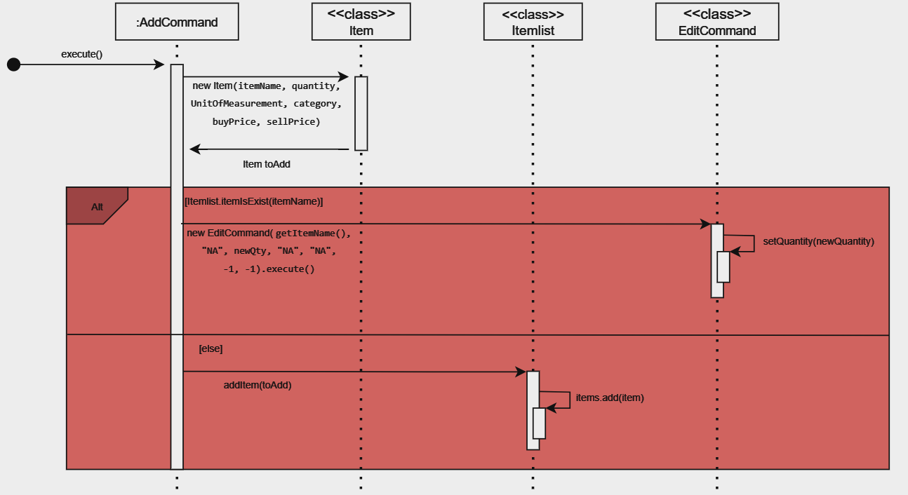
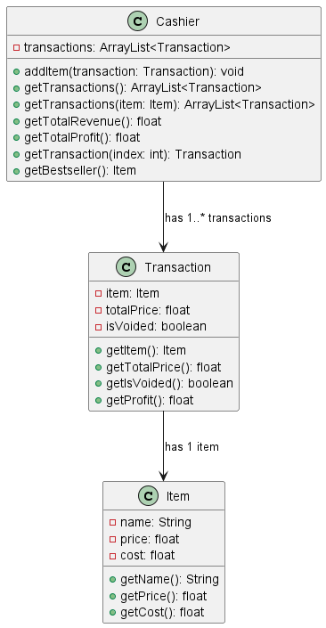
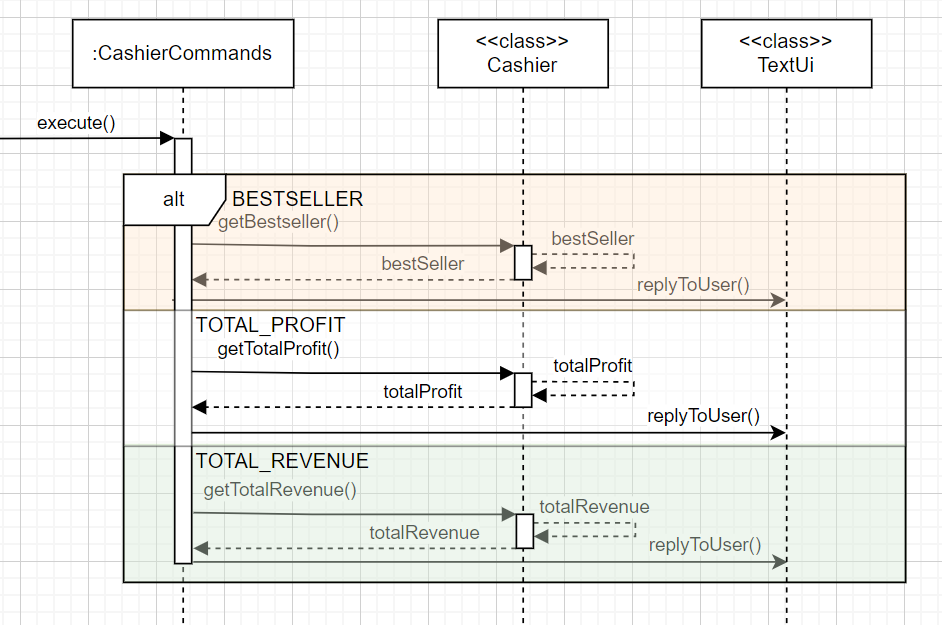
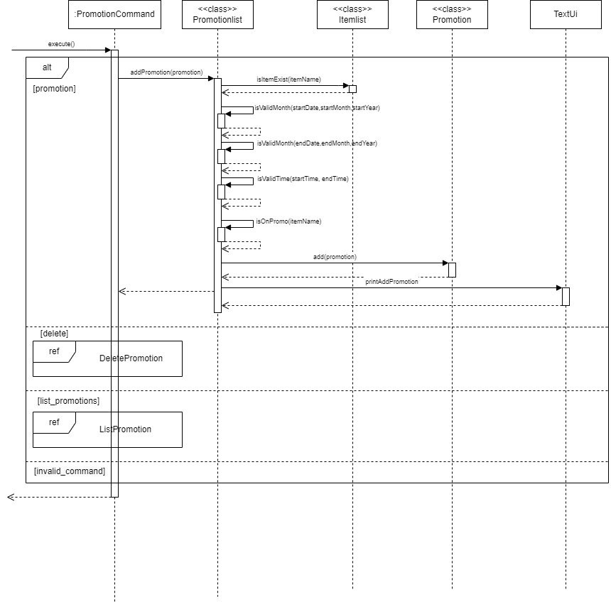
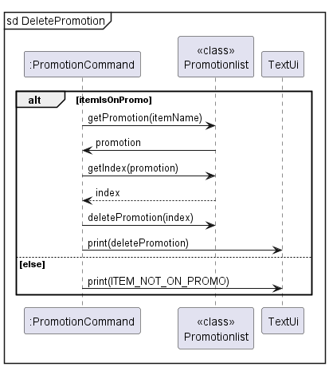

# Developer Guide

## Acknowledgements

{list here sources of all reused/adapted ideas, code, documentation, and third-party libraries -- include links to the original source as well}

## Design

{Describe the design and implementation of the product. Use UML diagrams and short code snippets where applicable.}

### Command
The Command class is an abstract class which is extended to execute the various commands 
used in the product.

{Describe the design of the product. Use UML diagrams and short code snippets where applicable.}
### Exception

### Itemlist
Itemlist class is an object which contains items to be added to the stock inventory list. Able to add items, remove functions, edit items inside
the list.

The `AddCommand` class extends the `Command` class, allowing users to add items to the `Itemlist`



### Item
Item class is an object which represents an item in the stock inventory list. Stores data about the item such as item price, 
quantity of item, and others.
### Parser
Parser class processes user inputs and sieves out relevant details before calling the relevant methods.
It contains command formats that must be adhered to for the methods to be called.
### Storage
* Storage class contains method `addToFile()` to write data of items to the default file directory, `./StockMasterData.txt`.
* `overwriteFile()` write data of items to the default file directory, overwriting previous contents in the file.
* Method `readFromFile()` retrieve information from the file when program restarts. Information is used to create new `Item` object, which is added to 
the Itemlist by `addItem()` method.
### UI

### Cashier
Cashier class extends Itemlist class

#### Class diagram

The Cashier class extends the Itemlist Class.




## Implementation

This section describes some noteworthy details on how certain features are implemented

### [Proposed] Promotion feature

The promotion mechanism is facilitated by `StockMaster`. It enables the user to design and create discount offers for his/her 
own business given a certain period and time. Additionally, it implements the following operations:
* `promotion`
* `del_promotion`
* `list_promotions`


Given below is the overall sequence diagram for the `PromotionCommand`.


The PromotionCommand will execute the appropriate command and prints messages to the user through the `TextUi`.

#### Add new promotion:

The add promotion command has 5 compulsory arguments `ITEM_NAME`, `discount/`, `period /from`, `/to`, `time /from` and `to`

Example: 

```
promotion apple discount/50 period /from 1 Jan 2024 /to 31 Dec 2024 time from/ 0000 /to 2359
```
#### Add Promotion Class Diagram

Given below is the class diagram showing the class structure of the add promotion mechanism:


#### Add Promotion Sequence Diagram

Given below is the sequence diagram showing the add promotion mechanism:



This command will add a new promotion by calling `addPromotion(promotion)` method in `Promotionlist.java`. The 
`addPromotion(promotion)` then calls `isItemExist(apple)` in `Itemlist.java` to check if the item exists in the inventory. 


Next, it subsequently calls multiple of its own methods. 
1. `ItemIsOnPromo()` checks if there is already an existing `promotion` for the item. If there is an existing promotion
the user will be unable to create another promotion for the same item.
2. `isValidDiscount()` checks if the `discount` inputed lies between the range of 0 to 100.
3. `isValidMonth()` checks if the `date` entered is valid. E.g. `30 FEB 2024` does not exists.
4. `isValidTime()` checks if the time is a valid range.
5. `isValidDuration()` checks if the duration of the promotion is valid. E.g. A promotion that starts on `1 FEB 2024` and
ends on `1 JAN 2024` is not valid.

Then, `add(promotion)` method is called in `Promotion.java` to create the promotion. 

A response will then be printed to the `TextUi` to inform the user on the successful creation of the promotion.

**Delete promotion:**

This command has one compulsory argument `ITEM_NAME`.

Example: 
```
del_promo apple
```

#### Delete Promotion Sequence Diagram

Given below is the sequence diagram showing the delete promotion mechanism:



This command will initially check if there is such an item in `Promotionlist`. If it does not exists, it will print an
error message. Otherwise, it will execute the deletion of the `promotion`.

To execute the deletion, `getPromotion()` and `getIndex()` methods are called to obtain the index of the item in the
`Promotionlist`. 

The promotion will be deleted by calling `deletePromotion(index)` method in `Promotionlist.java` and will inform the
user on the successful deletion of the promotion via the `TextUi`.

**List promotion:**

This command lists all the `promotion` in `Promotionlist`.

Example:
```
list_promotions
```

#### List Promotion Sequence Diagram


All of the `Promotions` will be shown to the user through the `TextUi`. 


## Product scope
StockMaster allows users to use the following commands:
* add: add an item, quantity, category, buy price and sell price
* del: delete an item
* edit: edit the quantity of an item
* sell: sell a certain quantity of an item at a stated price
* find: find a specific item using a keyword
* list: list all items in the inventory
* help: list all commands
* exit: exit StockMaster

### Target user profile

Small Business Owners who:
* has a need to manage a significant number of inventory products
* able to track revenue/loss of the business
* prefer desktop apps over other types
* can type fast
* prefers typing to mouse interactions
* is reasonably comfortable using CLI apps

### Value proposition

Help small business owners organise and better manage their inventory faster than 
a typical mouse/GUI driven app


## User Stories

| Version | As a ... | I want to ...               | So that I can ...                                           |
|---------|----------|-----------------------------|-------------------------------------------------------------|
| v1.0    | new user | see usage instructions      | refer to them when I forget how to use the application      |
| v1.0    | user     | add new items               |                                                             |
| v1.0    | user     | make changes to added items | change details about items such as quantity or price        |
| v1.0    | user     | search for specific items   |                                                             |
| v2.0    | user     | find a to-do item by name   | locate a to-do without having to go through the entire list |

## Non-Functional Requirements

{Give non-functional requirements}

## Glossary

* *CLI* - Command Line Interface, where the user types commands rather than clicking options.
* *Item* - Item to be sold at the shop, with key information such as quantity, buying/selling price, description etc.

## Instructions for manual testing

{Give instructions on how to do a manual product testing e.g., how to load sample data to be used for testing}
