# Developer Guide

## Acknowledgements

{list here sources of all reused/adapted ideas, code, documentation, and third-party libraries -- include links to the original source as well}

## Design

### Command
The Command class is an abstract class which is extended to execute the various commands 
used in the product. It contains the abstract method `execute`, which is overridden by all other Command child classes.

### Exception

### Item
Item class is an object which represents an item in the stock inventory list. Stores data about the item such as item 
price, quantity of item, and others.

### Itemlist
Itemlist class is an object which contains items to be added to the stock inventory list. Able to add items, 
remove functions, edit items inside  the list.

To list items in the `Itemlist` to the user, the `ListCommand` class is used.

#### Sequence Diagram of `ListCommand` when used to list items.

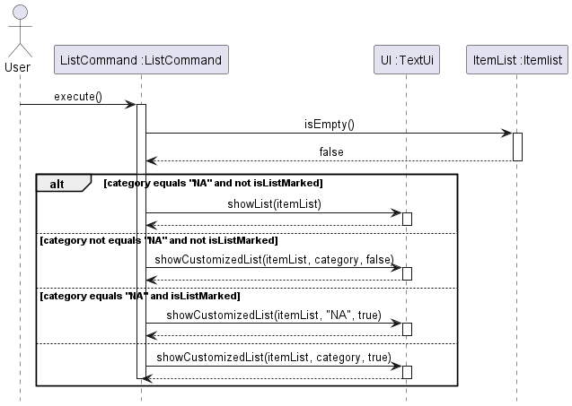
1. An instance of `ListCommand` is created with parameters specifying what category to list, or whether to only 
list marked items, as well as an `Itemlist` class. 
2. The `execute()` method is then called, checking for modifiers such as category or isListMarked.
3. Depending on the modifiers, different things will happen.
   - If there are no modifiers, `ListCommand` will display all items in the list by calling `TextUi.ShowList()`.
4. If there are modifiers present, `ShowCustomizedItemList()` will be called.
   - If there is a category present, `ListCommand` will get the category of every item in the `Itemlist` with 
   `Item.getCategory()`. 
   - If isListMarked is true, `ListCommand` will get the mark status of evey item in the `Itemlist` with 
   `Item.getMarkStatus()`.
   - Afterwards, `TextUi.replyToUser()` will be called, displaying the relevant items. 


The `AddCommand` class extends the `Command` class, allowing users to add items to the `Itemlist`

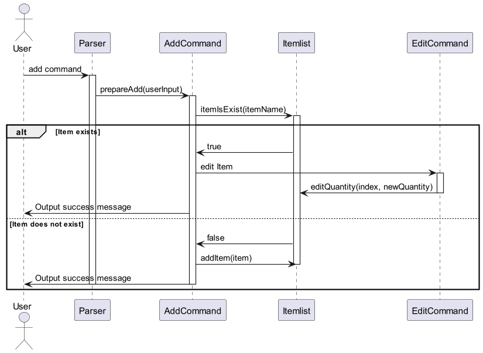

The `EditCommand` class extends the `command` class.
The `EditCommand` is responsible for editing attributes of an item in the `Itemlist`. This includes changing the
item's name, quantity, unit of measurement, category, buy price, and sell price. 
The command modifies the relevant item if it exists and updates the system accordingly.

#### Class Diagram of `EditCommand` and with partial Class Diagrams of `Item` and `Itemlist`

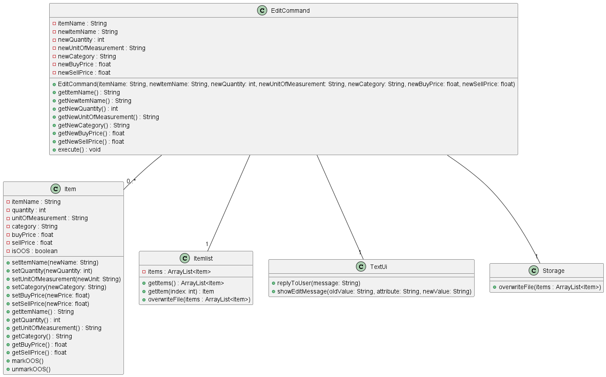

#### Sequence Diagram of `EditCommand`
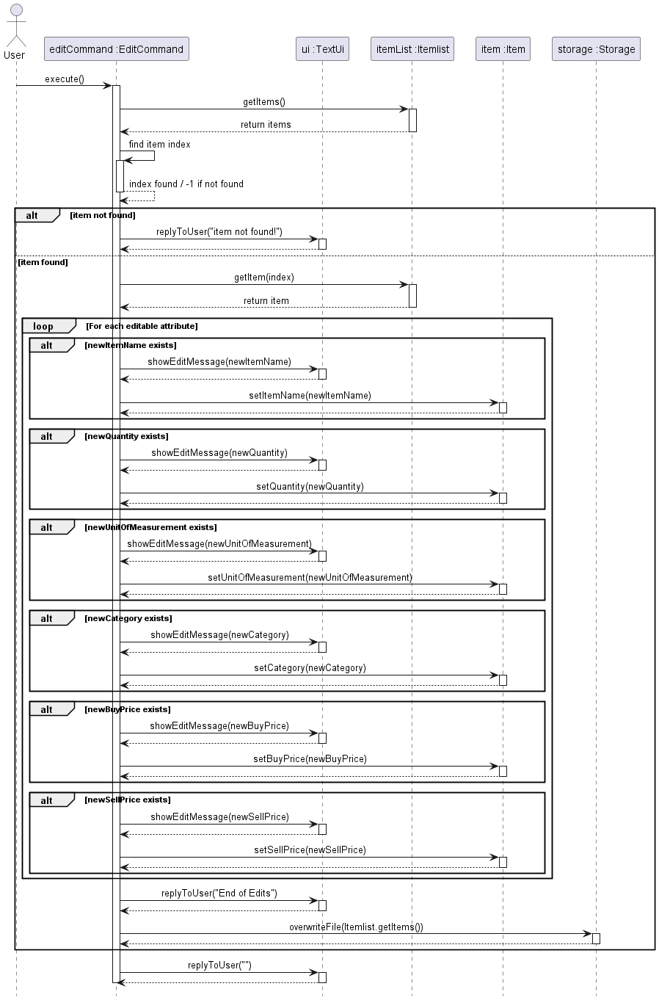

1. When an instance of `EditCommand` is created, the parameters indicating the item to be edited and the new values for
these parameters are also specified.
2. - Afterwards, the `execute()` method will be called, which first interacts with `Itemlist` class by calling 
`Itemlist.getItems()` to retrieve the list of all items.
   - If the item is found, it retreives the index of the item. If not, a messasge indicating that item is not found 
   will be displayed using `TextUi.replyToUser()`.
3. If an item is found, the `Itemlist.getItem(index)` method is used to retrieve the item object. For each
attribute that needs modification, the corresponding setter method on the `Item` objet is called, such as 
`setItemName()`, `setQuantity()`, etc.
4. Once all changes have been made, `TextUi.replyToUser()` is called to display to the user that the editing 
process had concluded.
5. Finally, `Storage.overwriteFile(Itemlist.getItems())` is called to write changes to the local save file.


### Parser
Parser class processes user inputs and sieves out relevant details before calling the relevant methods.
It contains command formats that must be adhered to for the methods to be called.

### Storage
* Storage class contains method `addToFile()` to write data of items to the default file directory, `./StockMasterData.txt`.
* `overwriteFile()` write data of items to the default file directory, overwriting previous contents in the file.
* Method `readFromFile()` retrieve information from the file when program restarts. Information is used to create new `Item` object, which is added to 
the Itemlist by `addItem()` method.

### Class diagram
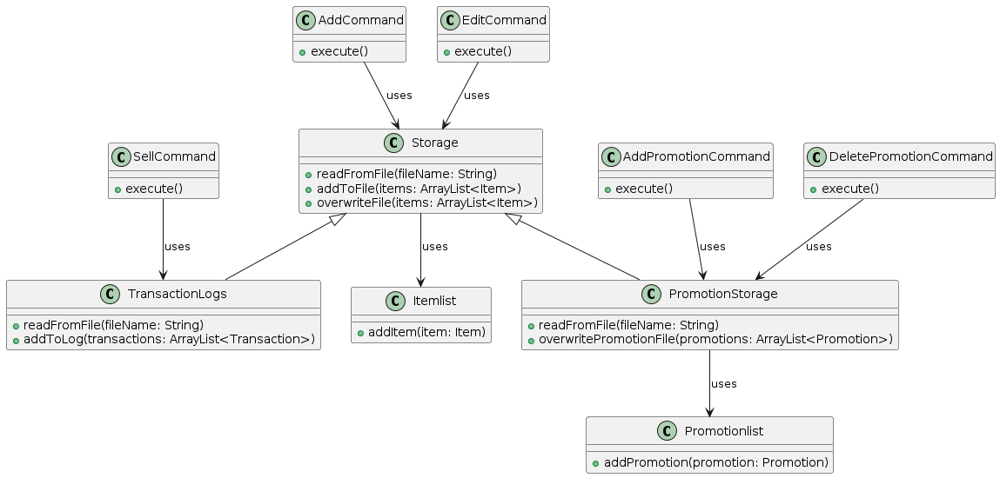
### Sequence diagram
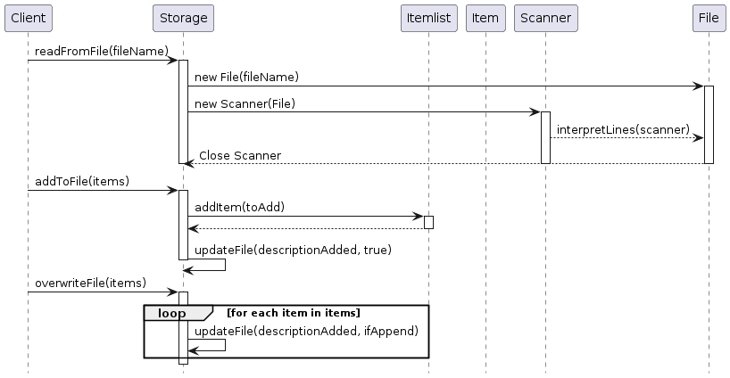

### UI
UI prints command output, and useful messages to the user.

### Cashier
Cashier class extends Itemlist class, and stores `Transactions` instead of `Items`.

#### Class Diagram
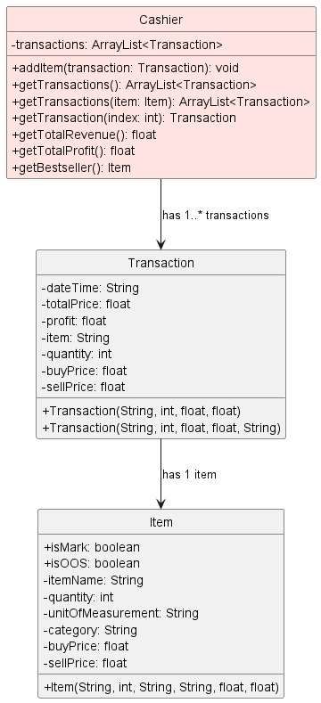

#### Sequence Diagrams
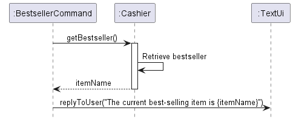
The `BestsellerCommand` calls the `getBestseller()` command from the Cashier

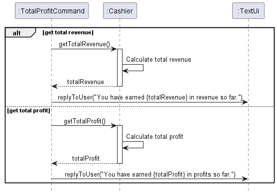

## Implementation

This section describes some noteworthy details on how certain features are implemented

### Promotion feature

The promotion mechanism is facilitated by `StockMaster`. It enables the user to design and create discount offers for his/her 
own business given a certain period and time. Additionally, it implements the following operations:
* `promotion`
* `del_promotion`
* `list_promotions`


Given below is the overall sequence diagram for the `PromotionCommand`. The reference frames are shown when explaining
the operations.

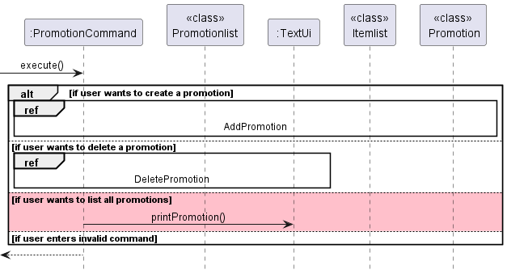


The PromotionCommand will execute the appropriate command and prints messages to the user through the `TextUi`.

#### Add new promotion:

The add promotion command has 5 compulsory arguments `ITEM_NAME`, `discount/`, `period /from`, `/to`, `time /from` and `to`

Example: 

```
promotion apple discount/50 period /from 1 Jan 2024 /to 31 Dec 2024 time from/ 0000 /to 2359
```
#### Add Promotion Class Diagram

Given below is the class diagram showing the class structure of the add promotion mechanism:

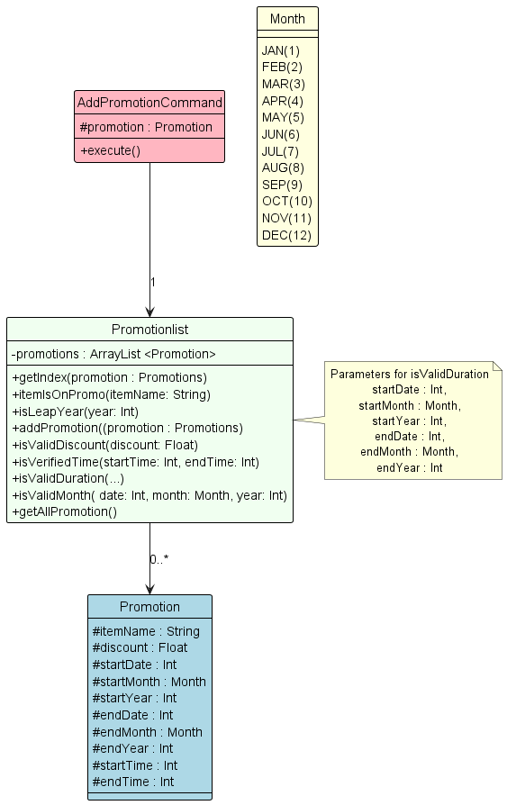

#### Add Promotion Sequence Diagram

Given below is the sequence diagram showing the add promotion mechanism.

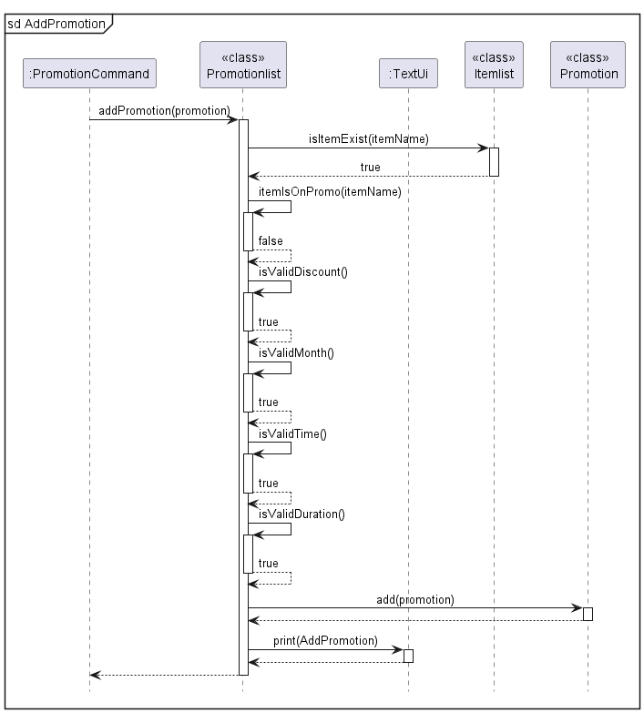

This command will add a new promotion by calling `addPromotion(promotion)` method in `Promotionlist.java`. The 
`addPromotion(promotion)` then calls `isItemExist(apple)` in `Itemlist.java` to check if the item exists in the inventory. 


Next, it subsequently calls multiple of its own methods. 
1. `ItemIsOnPromo()` checks if there is already an existing `promotion` for the item. If there is an existing promotion
the user will be unable to create another promotion for the same item.
2. `isValidDiscount()` checks if the `discount` input lies between the range of 0 to 100.
3. `isValidMonth()` checks if the `date` entered is valid. E.g. `30 FEB 2024` does not exist.
4. `isValidTime()` checks if the time is a valid range.
5. `isValidDuration()` checks if the duration of the promotion is valid. E.g. A promotion that starts on `1 FEB 2024` and
ends on `1 JAN 2024` is not valid.

The sequence diagram shows the successful creation of a promotion. However, if any of the `boolean` values do not follow
as per the diagram, an error message will be shown to the user via the `TextUi`.

Then, `add(promotion)` method is called in `Promotion.java` to create the promotion. 

A response will then be printed to the `TextUi` to inform the user on the successful creation of the promotion.

**Delete promotion:**

This command has one compulsory argument `ITEM_NAME`.

Example: 
```
del_promo apple
```

#### Delete Promotion Sequence Diagram

Given below is the sequence diagram showing the delete promotion mechanism:

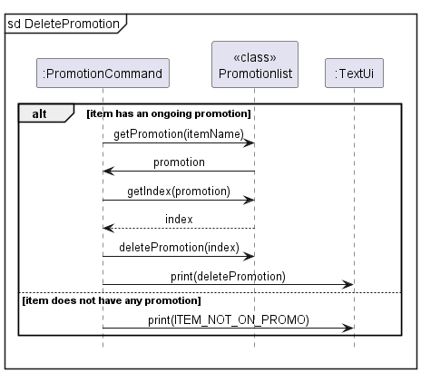

This command will initially check if there is such an item in `Promotionlist`. If it does not exist, it will print an
error message. Otherwise, it will execute the deletion of the `promotion`.

To execute the deletion, `getPromotion()` and `getIndex()` methods are called to obtain the index of the item in the
`Promotionlist`. 

The promotion will be deleted by calling `deletePromotion(index)` method in `Promotionlist.java` and will inform the
user on the successful deletion of the promotion via the `TextUi`.

**List promotion:**

This command lists all the `promotion` in `Promotionlist`.

Example:
```
list_promotions
```

#### List Promotion Sequence Diagram

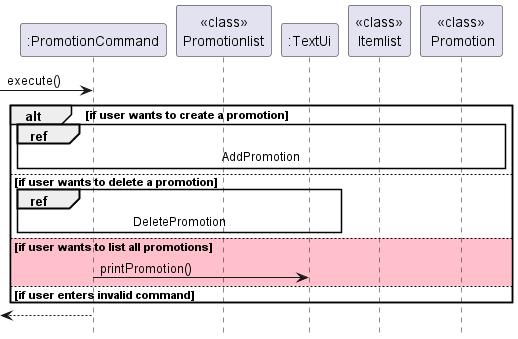

All of the `Promotions` will be shown to the user through the `TextUi`. 


## Product scope

### Target user profile

Small Business Owners who:
* has a need to manage a significant number of inventory products
* able to track revenue/loss of the business
* set up promotions for the items
* needs reminders for items that are low on stock
* prefer desktop apps over other types
* can type fast
* prefers typing to mouse interactions
* is reasonably comfortable using CLI apps

### Value proposition

StockMaster helps small business owners organise and manage their business. The purpose of such application is to provide
users with a range of tools and features to help them better operate their business. This will enable them to make more
informed decisions to ensure that they are consistently having a profit. The application allows users to keep track of 
their inventory, promotions and transaction logs. It also lets the user see the earnings/loss of the business. Furthermore, 
it also allows users to see which item has generated the most profit in the business.


## User Stories

| Version | As a ...    | I want to ...                                                 | So that I can ...                                                            |
|---------|-------------|---------------------------------------------------------------|------------------------------------------------------------------------------|
| v1.0    | new user    | see usage instructions                                        | refer to them when I forget how to use the application                       |
| v1.0    | user        | add new items                                                 | update my inventory list                                                     |
| v1.0    | user        | make changes to added items                                   | change details about items such as quantity, price                           |
| v1.0    | user        | delete item                                                   | remove items that are no longer required                                     |
| v1.0    | user        | search for specific item                                      | easily check how much quantity I have left for that item                     |
| v1.0    | user        | list out my inventory                                         | view all items that I have                                                   |
| v2.0    | store owner | include new item information such as buying and selling price | operate my business and sell to customers                                    |
| v2.0    | store owner | search for items in a filtered list                           | easily check the item information based on the filtered list                 |
| v2.0    | store owner | keep track of how much I spend                                | generate my overall expenditure                                              |
| v2.0    | store owner | keep track of how much I earn                                 | generate my overall revenue                                                  |
| v2.0    | store owner | get my overall profit                                         | know if my business is earning or losing money                               |
| v2.0    | store owner | sell items                                                    | start earning money from my business                                         |
| v2.0    | store owner | see reminders for items that are low on stock                 | easily know which item I have to schedule for a restock                      |
| v2.0    | store owner | add promotions for a time period                              | automatically change the sell price of the items during the promotion period |
| v2.0    | store owner | delete promotions                                             | remove promotions when it is over                                            |
| v2.0    | store owner | list promotions                                               | view all promotions that I have created                                      |
| v2.0    | store owner | mark items of different categories at my own discretion       | easily view the list of marked items when I want to                          |
| v2.0    | store owner | see what is my best selling item                              | identify which item is most popular among customers                          |

## Non-Functional Requirements

* The application should work on main OS (Windows, Linux, Mac) that has Java 11 installed.
* The application is designed for a single user.
* This application is targeted towards users who have an above average typing speed.
* This application requires the user to have an accurate clock on the main OS.
* This application does not allow users to amend the text file that are used as storage.

## Glossary

* *CLI* - Command Line Interface, where the user types commands rather than clicking options.
* *Item* - Item to be sold at the shop, with key information such as quantity, buying/selling price, description etc.

## Instructions for manual testing

{Give instructions on how to do a manual product testing e.g., how to load sample data to be used for testing}
